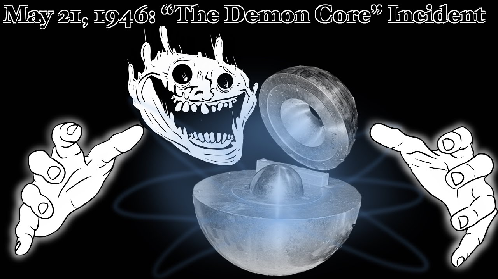

# Теория по силе Лоренца

*Сила Лоренца* - **сила, с которой магнитное поле действует на заряженную частицу, которая двигается в магнитном поле.**

Определить направление силы Лоренца можно по правилу **левой** руки.

## Правило левой руки:
1. Направляем 4 пальца левой руки по вектору скорости.
2. Вектора магнитной индукции входят в ладонь.
3. Оттогнутый большой палец покажет направление силы Лоренца для <u>положительной</u> частицы.
4. Если частица отрицательная, то берём противоположное направление.

Существует 3 вида радиоактивного излучения:
* Альфа-излучение (ион гелия);
* Бета-излучение (электрон);
* Гамма-излучение (электромагнитная волна)

